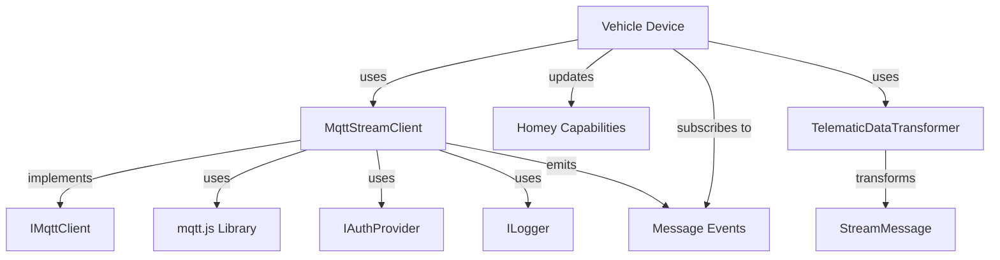
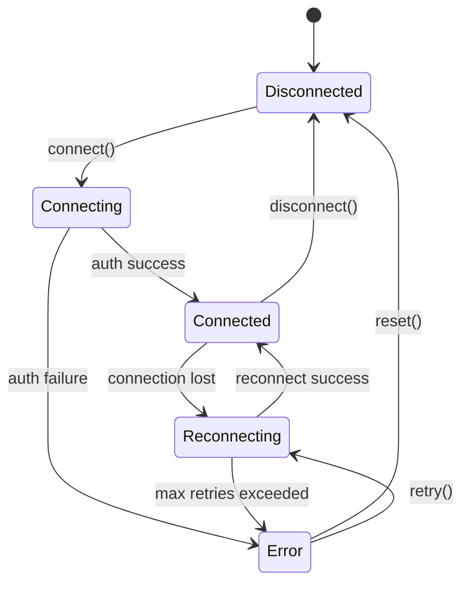
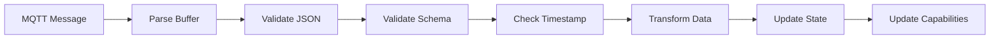

# MQTT Streaming Client Architecture

## Purpose

This specification defines the architecture for the MQTT streaming client that enables real-time vehicle data updates from the BMW CarData API. The client provides a robust, maintainable abstraction over the MQTT protocol while integrating seamlessly with the existing authentication and data transformation layers.

## Architecture Overview



## Component Design

### 1. IMqttClient Interface

**Location**: `lib/streaming/IMqttClient.ts`

**Purpose**: Define the contract for MQTT client implementations.

```typescript
export interface IMqttClient {
  // Connection management
  connect(): Promise<void>;
  disconnect(): Promise<void>;
  isConnected(): boolean;
  getConnectionState(): ConnectionState;

  // Subscription management
  subscribe(topic: string, qos?: QoS): Promise<void>;
  unsubscribe(topic: string): Promise<void>;
  getActiveSubscriptions(): string[];

  // Event handlers
  onConnect(handler: () => void): void;
  onDisconnect(handler: (error?: Error) => void): void;
  onReconnect(handler: () => void): void;
  onMessage(handler: (topic: string, message: StreamMessage) => void): void;
  onError(handler: (error: Error) => void): void;
}

export type ConnectionState =
  | 'disconnected'
  | 'connecting'
  | 'connected'
  | 'reconnecting'
  | 'error';

export type QoS = 0 | 1 | 2;
```

**Design Decisions**:

- **Event-Based**: Uses callback handlers for async events
- **Promise-Based**: Connection/subscription methods return promises
- **State Management**: Exposes connection state for UI updates
- **Type Safety**: Strong typing for QoS levels and connection states

### 2. MqttStreamClient Implementation

**Location**: `lib/streaming/MqttStreamClient.ts`

**Purpose**: Concrete implementation of IMqttClient using mqtt.js library.

```typescript
export interface MqttStreamClientOptions {
  broker: string; // e.g., 'customer.streaming-cardata.bmwgroup.com'
  port: number; // e.g., 9000
  protocol: 'mqtts' | 'wss'; // SSL/TLS protocol
  clientIdPrefix?: string; // e.g., 'homey-bmw-'
  keepalive?: number; // seconds (default: 60)
  reconnectPeriod?: number; // milliseconds (default: 1000)
  connectTimeout?: number; // milliseconds (default: 30000)
  clean?: boolean; // clean session (default: false)
  resubscribe?: boolean; // auto-resubscribe (default: true)
  qos?: QoS; // default QoS (default: 1)
}

export class MqttStreamClient implements IMqttClient {
  private client?: mqtt.MqttClient;
  private authProvider: IAuthProvider;
  private logger?: ILogger;
  private options: MqttStreamClientOptions;
  private subscriptions: Map<string, QoS>;
  private connectionState: ConnectionState;
  private eventHandlers: {
    connect: (() => void)[];
    disconnect: ((error?: Error) => void)[];
    reconnect: (() => void)[];
    message: ((topic: string, message: StreamMessage) => void)[];
    error: ((error: Error) => void)[];
  };

  constructor(authProvider: IAuthProvider, options: MqttStreamClientOptions, logger?: ILogger) {
    // Initialize properties
  }

  // Implementation methods...
}
```

**Key Features**:

1. **Automatic Reconnection**: Built-in exponential backoff
2. **Token Management**: Integrates with IAuthProvider for token refresh
3. **Message Parsing**: Validates and parses JSON messages
4. **Error Handling**: Graceful error handling with logging
5. **Subscription Tracking**: Maintains map of active subscriptions
6. **Event Aggregation**: Supports multiple event handlers per event type

### 3. StreamMessage Model

**Location**: `lib/streaming/StreamMessage.ts`

**Purpose**: Define the structure of MQTT messages from BMW CarData API.

```typescript
export interface StreamMessage {
  vin: string;
  entityId: string;
  topic: string;
  timestamp: string; // ISO 8601
  data: Record<string, TelematicDataPoint>;
}

export interface TelematicDataPoint {
  timestamp: string; // ISO 8601
  value: string | number | boolean;
  unit?: string;
}

export interface StreamMessageValidator {
  validate(message: unknown): message is StreamMessage;
  parse(buffer: Buffer): StreamMessage;
}
```

**Validation Rules**:

- `vin`: Required, 17 characters
- `entityId`: Required, valid UUID
- `topic`: Required, matches VIN
- `timestamp`: Required, valid ISO 8601
- `data`: Required, object with at least one telematic point

### 4. Constants

**Location**: `lib/streaming/constants.ts`

**Purpose**: Centralize MQTT configuration constants.

```typescript
export const MQTT_BROKER_HOST = 'customer.streaming-cardata.bmwgroup.com';
export const MQTT_BROKER_PORT = 9000;
export const MQTT_PROTOCOL = 'mqtts' as const;

export const DEFAULT_MQTT_OPTIONS: Partial<MqttStreamClientOptions> = {
  broker: MQTT_BROKER_HOST,
  port: MQTT_BROKER_PORT,
  protocol: MQTT_PROTOCOL,
  keepalive: 60,
  reconnectPeriod: 1000,
  connectTimeout: 30000,
  clean: false,
  resubscribe: true,
  qos: 1,
};

export const MQTT_QOS_LEVELS = {
  AT_MOST_ONCE: 0,
  AT_LEAST_ONCE: 1,
  EXACTLY_ONCE: 2,
} as const;

export const RECONNECT_DELAYS = {
  MIN: 1000, // 1 second
  MAX: 60000, // 60 seconds
  MULTIPLIER: 2, // exponential backoff
  JITTER: 1000, // random jitter (ms)
} as const;
```

## Authentication Flow

### MQTT Credential Derivation

```typescript
interface MqttCredentials {
  username: string; // gcid from token
  password: string; // id_token
  clientId: string; // generated stable ID
}

async function getMqttCredentials(
  authProvider: IAuthProvider,
  vin: string
): Promise<MqttCredentials> {
  const token = await authProvider.getValidAccessToken();

  if (!token.gcid) {
    throw new AuthenticationError('Missing gcid in token');
  }

  if (!token.idToken) {
    throw new AuthenticationError('Missing id_token in token');
  }

  return {
    username: token.gcid,
    password: token.idToken,
    clientId: generateClientId(vin),
  };
}

function generateClientId(vin: string): string {
  // Idempotent: same VIN always generates same client ID
  // Format: homey-bmw-{hash(vin)}
  const hash = createHash('sha256').update(vin).digest('hex').substring(0, 16);
  return `homey-bmw-${hash}`;
}
```

**Important Notes**:

- `gcid` (Global Customer ID) identifies the user account
- `id_token` (JWT) serves as the password (NOT `access_token`)
- Client ID should be stable across reconnections
- Token refresh triggers MQTT reconnection

## Connection Lifecycle

### State Transitions



### Connection Sequence

1. **Initialize**: Create MqttStreamClient with auth provider
2. **Get Credentials**: Fetch gcid and id_token from auth provider
3. **Connect**: Establish SSL/TLS connection to broker
4. **Authenticate**: Send username (gcid) and password (id_token)
5. **Subscribe**: Subscribe to VIN topic with QoS 1
6. **Receive Messages**: Handle incoming telematic data
7. **Disconnect**: Unsubscribe and close connection on cleanup

### Reconnection Logic

```typescript
class ReconnectionManager {
  private attempt: number = 0;
  private timer?: NodeJS.Timeout;

  scheduleReconnect(callback: () => void): void {
    const delay =
      Math.min(
        RECONNECT_DELAYS.MIN * Math.pow(RECONNECT_DELAYS.MULTIPLIER, this.attempt),
        RECONNECT_DELAYS.MAX
      ) +
      Math.random() * RECONNECT_DELAYS.JITTER;

    this.timer = setTimeout(() => {
      this.attempt++;
      callback();
    }, delay);
  }

  reset(): void {
    this.attempt = 0;
    if (this.timer) {
      clearTimeout(this.timer);
      this.timer = undefined;
    }
  }
}
```

## Message Processing

### Message Handler Pipeline



### Message Processing Flow

```typescript
async function handleMessage(topic: string, payload: Buffer): Promise<void> {
  try {
    // 1. Parse buffer to JSON
    const message = parseStreamMessage(payload);

    // 2. Validate message structure
    if (!validateStreamMessage(message)) {
      throw new ValidationError('Invalid message structure');
    }

    // 3. Check timestamp freshness
    if (!isMessageFresh(message.timestamp)) {
      this.logger?.warn('Stale message received', { timestamp: message.timestamp });
      return;
    }

    // 4. Transform telematic data
    const updates = transformTelematicData(message.data);

    // 5. Merge with current state
    this.mergeState(updates);

    // 6. Update Homey capabilities
    await this.updateCapabilities(updates);

    // 7. Emit message event
    this.emitMessageEvent(topic, message);
  } catch (error) {
    this.logger?.error('Failed to handle MQTT message', { error, topic });
    this.emitErrorEvent(error);
  }
}
```

## Integration with Vehicle Device

### Vehicle Device Updates

```typescript
class Vehicle extends Homey.Device {
  private mqttClient?: MqttStreamClient;
  private lastMqttUpdate?: Date;

  async onInit(): Promise<void> {
    // ... existing initialization ...

    // Initialize MQTT streaming
    await this.initializeMqttStreaming();
  }

  private async initializeMqttStreaming(): Promise<void> {
    const settings = await DeviceSettings.load(this);

    if (!settings.streamingEnabled) {
      this.log('MQTT streaming disabled in settings');
      return;
    }

    const authProvider = this.getAuthProvider();
    const logger = this.getLogger();

    this.mqttClient = new MqttStreamClient(
      authProvider,
      {
        ...DEFAULT_MQTT_OPTIONS,
        clientIdPrefix: 'homey-bmw-',
      },
      logger
    );

    // Register event handlers
    this.mqttClient.onConnect(() => {
      this.log('MQTT connected');
      this.setCapabilityValue('streaming_status', 'connected').catch(this.error);
    });

    this.mqttClient.onMessage((topic, message) => {
      this.handleMqttMessage(message).catch(this.error);
    });

    this.mqttClient.onError((error) => {
      this.error('MQTT error:', error);
      this.setCapabilityValue('streaming_status', 'error').catch(this.error);
    });

    // Connect and subscribe
    await this.mqttClient.connect();
    await this.mqttClient.subscribe(this.getData().id); // VIN
  }

  private async handleMqttMessage(message: StreamMessage): Promise<void> {
    this.lastMqttUpdate = new Date();

    // Transform partial telematic data
    const updates = this.transformMqttData(message.data);

    // Update capabilities
    for (const [capability, value] of Object.entries(updates)) {
      await this.setCapabilityValue(capability, value);
    }

    // Store last update timestamp
    await DeviceSettings.update(this, {
      lastStreamMessageAt: this.lastMqttUpdate,
      streamMessageCount: (await DeviceSettings.load(this)).streamMessageCount + 1,
    });
  }

  async onDeleted(): Promise<void> {
    // Clean up MQTT connection
    if (this.mqttClient) {
      await this.mqttClient.disconnect();
      this.mqttClient = undefined;
    }
  }
}
```

### Fallback Strategy

```typescript
async updateState(): Promise<void> {
  const mqttActive = this.mqttClient?.isConnected() &&
                     this.isRecentUpdate(this.lastMqttUpdate);

  if (mqttActive) {
    // MQTT is active and recent, reduce API polling
    this.log('Using MQTT streaming for updates');
    // Still update occasionally for data not in MQTT
    if (this.shouldFullSync()) {
      await this.fetchFromApi();
    }
  } else {
    // MQTT unavailable, fall back to API polling
    this.log('MQTT unavailable, using API polling');
    await this.fetchFromApi();
  }
}

private isRecentUpdate(lastUpdate?: Date): boolean {
  if (!lastUpdate) return false;
  const age = Date.now() - lastUpdate.getTime();
  return age < 60000; // 60 seconds
}
```

## Error Handling

### Error Categories

1. **Connection Errors**: Network issues, broker unavailable
2. **Authentication Errors**: Invalid credentials, token expired
3. **Subscription Errors**: Topic not found, permission denied
4. **Message Errors**: Invalid JSON, schema validation failure
5. **Processing Errors**: Transformation failure, capability update failure

### Error Recovery Strategies

```typescript
class ErrorHandler {
  async handleError(error: Error): Promise<void> {
    if (error instanceof AuthenticationError) {
      // Refresh OAuth tokens
      await this.authProvider.refreshTokens();
      // Reconnect with new credentials
      await this.mqttClient.connect();
    } else if (error instanceof NetworkError) {
      // Use exponential backoff reconnection
      this.scheduleReconnect();
    } else if (error instanceof ValidationError) {
      // Log and skip invalid message
      this.logger?.warn('Invalid message', { error });
    } else {
      // Unknown error, disconnect and retry
      await this.mqttClient.disconnect();
      this.scheduleReconnect();
    }
  }
}
```

## Testing Strategy

### Unit Tests

1. **IMqttClient Mock**: Mock implementation for unit testing
2. **Message Parsing**: Test JSON parsing and validation
3. **Event Handlers**: Test event emission and handling
4. **Reconnection Logic**: Test backoff algorithm
5. **Credential Derivation**: Test gcid/id_token extraction

### Integration Tests

1. **Mock Broker**: Use Aedes for local MQTT broker
2. **Connection Flow**: Test full connection lifecycle
3. **Message Handling**: Test message processing pipeline
4. **Token Refresh**: Test reconnection on token expiry
5. **Error Scenarios**: Test network disconnect, auth failure

### End-to-End Tests

1. **Real Broker**: Test with BMW MQTT broker (requires real account)
2. **Multi-Device**: Test multiple vehicles simultaneously
3. **Long-Running**: Test 24+ hour stability
4. **Performance**: Test message throughput and latency

## Performance Considerations

### Memory Management

- **Message Queue**: Limit to 100 messages max
- **Event Handlers**: Weak references to prevent memory leaks
- **Subscription Map**: Clear on disconnect
- **Timers**: Always clear timers on cleanup

### CPU Usage

- **Debouncing**: Batch capability updates (max 1/second)
- **Async Processing**: Handle messages asynchronously
- **JSON Parsing**: Use native JSON.parse (fastest)
- **State Merging**: Only update changed values

### Network Optimization

- **QoS 1**: Balance reliability and performance
- **Keep-Alive**: 60-second intervals
- **Clean Session**: False (resume subscriptions)
- **Compression**: Not supported by broker

## Security Considerations

### Token Security

- **Storage**: Store id_token securely (never log)
- **Transmission**: Always use SSL/TLS
- **Refresh**: Refresh before expiration
- **Revocation**: Support token revocation

### Connection Security

- **TLS Version**: TLS 1.2 or higher
- **Certificate Validation**: Verify server certificate
- **Client ID**: Use hash (don't expose VIN directly)
- **Logging**: Redact sensitive data

## Future Enhancements

### Phase 2 Features

1. **Message Filtering**: Filter by telematic key categories
2. **Compression**: Support message compression (if BMW adds)
3. **Batch Updates**: Batch multiple updates before UI refresh
4. **Historical Buffering**: Buffer messages during disconnect
5. **Analytics**: Track message frequency, latency, errors

### Phase 3 Features

1. **Multi-Vehicle Optimization**: Shared connection for multiple vehicles
2. **Offline Queue**: Queue messages when device offline
3. **Delta Compression**: Only send changed values
4. **Predictive Updates**: Predict next update based on patterns

## References

- Domain Knowledge: `.github/.copilot/domain_knowledge/bmw-mqtt-streaming.md`
- MQTT.js Documentation: <https://github.com/mqttjs/MQTT.js>
- MQTT Protocol: <https://mqtt.org/mqtt-specification/>
- BMW CarData API: `bmw-cardata-ha/cardata_api_documentation.md`
- Python Reference: `bmw-cardata-ha/custom_components/cardata/coordinator.py`
